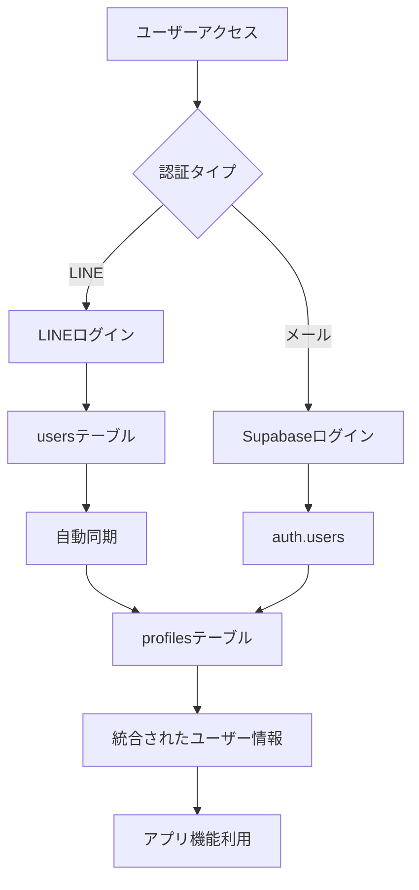

# 認証システム修正ガイド

## 📝 実施した修正内容

### 1. 問題点
- LINEログインとSupabase認証が統合されておらず、別々のシステムとして動作
- LINEログインではマイページがローディング中のまま表示されない
- コミュニティページがフッターのみ表示される
- LINEアカウントとメールアドレスアカウントが混同される

### 2. 実施した修正

#### AuthContext.tsx の修正
- `lineUser` と `isLineAuthenticated` フィールドを追加
- 初期化時にLINEセッションを優先的にチェック
- LINEユーザーとSupabaseユーザーの両方をサポート
- ログアウト処理でLINEセッションも適切にクリア

#### UserDashboard.tsx の修正
- LINEユーザーのIDも受け入れるように修正
- profilesテーブルにデータがない場合もエラーにならないように修正
- LINEユーザーの表示名を適切に表示

#### Community.tsx の修正
- LINEユーザーでもコミュニティ機能を使用可能に
- 認証チェックでLINEユーザーも考慮

### 3. データベース統合

LINEユーザー用のprofilesエントリーを自動作成するSQLマイグレーションを作成：
`supabase/migrations/20250131000000_line_user_profile_integration.sql`

このマイグレーションの機能：
- LINEユーザー（usersテーブル）がログインした際、自動的にprofilesテーブルにエントリーを作成
- 既存のLINEユーザーのprofilesエントリーを作成
- auth_typeカラムでメール認証とLINE認証を区別
- is_line_userフラグでLINEユーザーを識別

## 🚀 マイグレーション実行手順

### 1. Supabaseダッシュボードから実行（推奨）

1. Supabaseダッシュボードにログイン
2. 「SQL Editor」セクションに移動
3. `supabase/migrations/20250131000000_line_user_profile_integration.sql` の内容をコピー
4. SQL Editorに貼り付けて実行

### 2. Supabase CLIから実行

```bash
# Supabaseプロジェクトにリンク
npx supabase link --project-ref <your-project-ref>

# マイグレーションを実行
npx supabase db push
```

## 🔧 動作確認

### 1. LINEログインの確認
1. ブラウザのシークレットモードで https://dogparkjp.com/liff/login にアクセス
2. LINEでログイン
3. マイページ（/dashboard）が正常に表示されることを確認
4. コミュニティページ（/community）が正常に表示されることを確認

### 2. メールログインの確認
1. 別のブラウザまたはシークレットモードで通常のログインページ（/login）にアクセス
2. メールアドレスでログイン
3. マイページとコミュニティページが正常に動作することを確認

### 3. アカウントの分離確認
- LINEアカウントとメールアカウントが別々のアカウントとして認識されることを確認
- それぞれのアカウントで異なるワンちゃん情報を登録できることを確認

## 📊 認証フロー



## 🔒 セキュリティ考慮事項

1. **アカウント分離**: LINEアカウントとメールアカウントは完全に分離
2. **データ保護**: 各アカウントのデータは独立して管理
3. **認証の優先順位**: LINEセッションを優先的にチェック（LINEアプリ内での利用を想定）

## 🐛 トラブルシューティング

### 問題: マイページがまだローディング中のまま
**解決策**:
1. ブラウザのキャッシュをクリア
2. Supabaseのマイグレーションが正常に実行されたか確認
3. ブラウザの開発者ツールでエラーを確認

### 問題: コミュニティページが表示されない
**解決策**:
1. `effectiveUserId` が正しく設定されているか確認
2. Netlify Functionsが正常に動作しているか確認

### 問題: LINEログイン後、メールアドレスのアカウントとして認識される
**解決策**:
1. マイグレーションを実行してauth_typeカラムを追加
2. 一度ログアウトして再度ログイン

## 📚 関連ファイル

- `/src/context/AuthContext.tsx` - 認証コンテキスト
- `/src/pages/UserDashboard.tsx` - マイページ
- `/src/pages/Community.tsx` - コミュニティページ
- `/netlify/functions/auth-session.ts` - LINEセッション作成
- `/netlify/functions/auth-me.ts` - セッション情報取得
- `/supabase/migrations/20250131000000_line_user_profile_integration.sql` - データベース統合

## ✅ 完了したタスク

- [x] 認証システムの現状調査
- [x] マイページのローディング問題の修正
- [x] コミュニティページの表示問題の修正
- [x] LINEアカウントとメールアカウントの分離処理実装
- [x] LINEユーザー用のusersテーブルの構造確認
- [x] profilesテーブル統合マイグレーション作成

## 📝 メンテナンス注意事項

1. **新機能追加時**: 必ず`effectiveUserId`を使用してユーザーIDを取得
2. **認証チェック**: `user || lineUser || effectiveUserId` のパターンを使用
3. **プロフィール取得**: LINEユーザーの場合、profilesテーブルにデータがない可能性を考慮
